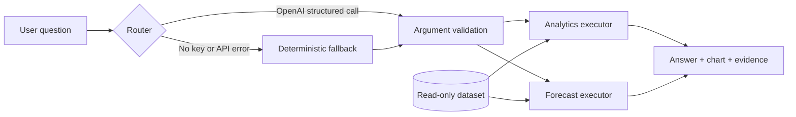

# Northstar Logistics Intelligence

Northstar is a full-stack logistics analytics dashboard built for the Spaceship Senior Engineer / AI Tech Lead take-home. It combines deterministic operational metrics, constrained AI tool routing, explainable visual answers, and a transparent demand-forecast baseline.

Live demo: https://northstar-logistics-ai.vercel.app

## What is included

- Five filter-aware KPIs: total orders, completed deliveries, delayed orders, on-time rate, and average delivery time
- Monthly order-volume, delivery-status, and carrier delay-rate visualizations
- Natural-language analytics with dynamic number, line-chart, or bar-chart responses
- Two constrained tools: `query_analytics` and `forecast_demand`
- Visible filters, metric, dimension, structured arguments, query plan, and row count for every AI answer
- Category-level demand forecasting with moving-average and linear-trend methods
- Explicit SKU-level abstention when fewer than four observed months are available
- Filtered raw-data evidence table
- Deterministic fallback when OpenAI is not configured or unavailable

## Run locally

Requires Node.js 22.

```bash
npm ci
cp .env.example .env.local
npm run dev
```

Open `http://localhost:3000`. Add an OpenAI API key to `.env.local` to enable model-based routing:

```dotenv
OPENAI_API_KEY=your_key_here
OPENAI_MODEL=gpt-5.6-luna
```

The dashboard and deterministic keyword router work without a key. Never commit `.env.local`.

## Validation

```bash
npm test
npm run lint
npm run build
```

`npm test` regenerates the typed JSON dataset from the supplied CSV, then verifies canonical metrics, dataset-relative date interpretation, forecast behavior, sparse-SKU abstention, and time-series peak narration.

## Architecture



The implementation deliberately separates three responsibilities:

1. `app/api/ask/route.ts` interprets a question and selects exactly one strictly-schemaed tool. The model is a router, never the source of a metric.
2. `lib/analytics.ts` validates filters and computes every aggregation, narrative, forecast, and inventory baseline in code.
3. `components/dashboard.tsx` renders the returned answer, a chart selected from the result shape, and the evidence used to produce it.

No generated SQL is executed. The application uses a small, explicit query plan against the supplied read-only data, which is easier to audit and appropriate for 400 records.

## AI orchestration

The API uses the OpenAI Responses API with strict function schemas, `tool_choice: required`, one tool call, no parallel calls, and response storage disabled. The prompt defines the dataset clock, metric semantics, and tool-selection rules. The selected arguments are validated again in application code before execution.

The AI does **not**:

- see or manipulate credentials
- execute SQL or arbitrary code
- calculate the answer shown to the user
- invent data when a forecast is unsupported

If the OpenAI call fails, the interface says so and uses a transparent keyword router. The deterministic computation path is identical in both modes.

## Metric definitions

| Metric | Definition |
| --- | --- |
| Total orders | Distinct `order_id` count |
| Completed deliveries | Status is `delivered` or `delayed` |
| Delayed orders | Status is `delayed` |
| On-time rate | `delivered / (delivered + delayed)` |
| Delay rate | `delayed / (delivered + delayed)` |
| Average delivery time | Calendar days from order to delivery for completed deliveries |
| Demand | Sum of ordered `quantity`, grouped by order month |

Canonical all-data results are 400 total orders, 359 completed deliveries, 55 delayed orders, 84.7% on-time, and 3.69 average delivery days.

## Forecasting approach

The forecasting tool aggregates ordered quantity by calendar month and supports:

- **Three-month moving average** — the default, stable baseline
- **Least-squares linear trend** — available when the user explicitly wants a trend method

The inventory suggestion is next month's forecast plus a disclosed 10% buffer. This is an assumption, not an optimized reorder point, because the source data has no lead time, stock-on-hand, stockout, supplier reliability, or target service-level fields.

The data contains 355 SKUs across 400 orders; most SKUs appear only once. SKU forecasting therefore abstains unless the SKU has observations in at least four distinct months. Category and overall forecasts are the responsible default.

## Data assumptions

- Order dates span 1 January through 30 December 2025.
- Relative questions use the dataset clock, not the wall clock. “Last month” means November 2025; “last 3 months” means October–December 2025.
- Delivery status is treated as the ground truth for on-time versus delayed completion because no SLA or promised-delivery field exists.
- In-transit and canceled records without delivery dates are excluded from completed-delivery duration metrics.
- `order_value_usd` from the source is used directly rather than recalculated in the UI.

## Limitations and next steps

- The forecast has no seasonality model or backtested error interval; with multiple years of history I would add rolling-origin validation and display uncertainty bands.
- A public demo that uses a paid model should add durable rate limiting or an authenticated evaluation route plus an API-project spending cap.
- At production scale, the same typed plans should compile to parameterized warehouse queries rather than loading all rows in memory.
- Observability would include structured tool-selection logs, latency, fallback rate, invalid-argument rate, and forecast error after actuals arrive.

## AI assistance disclosure

The implementation was produced with Codex assistance. AI was used to inspect the assignment, scaffold and implement code, reason about edge cases, generate the Open Graph social image, and draft documentation. All data definitions were verified against the supplied CSV and protected with executable tests. The final architecture intentionally prevents the model from being the source of numerical truth.
